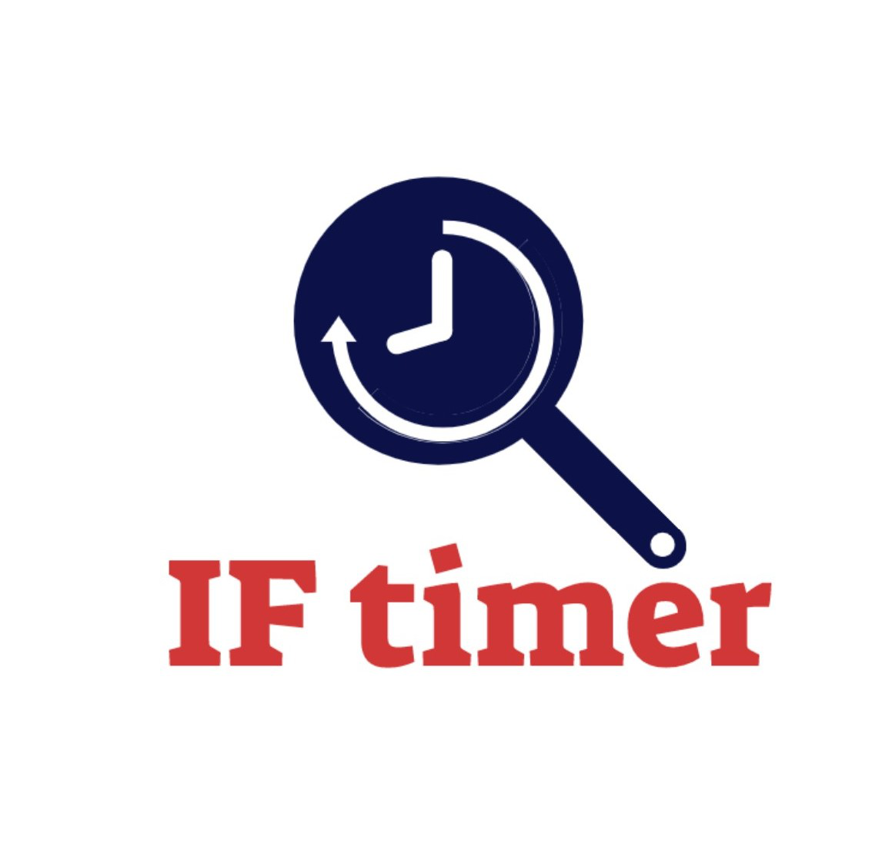

# IntermittentFastingApp

<!-- PROJECT LOGO -->
 

  

  <h3 align="center">IF(intermittent fasting) Timer</h3>

 

    <a href="https://expo.io/@kiharar/projects/intermittentfastingapp">View Demo</a>
 

<!-- TABLE OF CONTENTS -->

  
Table of Contents

  <ol>
    <li>
      <a href="#about-the-project">About The Project</a>
      <ul>
        <li><a href="#built-with">Built With</a></li>
      </ul>
    </li>
    <li>
      <a href="#getting-started">Getting Started</a>
      <ul>
        <li><a href="#prerequisites">Prerequisites</a></li>
        <li><a href="#installation">Installation</a></li>
      </ul>
    </li>
    <li><a href="#usage">Usage</a></li>
    <li><a href="#contact">Contact</a></li>
    <li><a href="#acknowledgements">Acknowledgements</a></li>
  </ol>

<!-- ABOUT THE PROJECT -->
## About The Project
<ul>
      
      
</ul>
 

## Built with
 - Typescript / ReactJS /JavaScript - ES6 / Shell
 - ReactNative/Expo 
 - VScode / Gimp / Movavi 

## Getting Started

*Android Phone 
 *With an Android phone, you can scan this QR code with your Expo mobile app to load this project immediately.
 *

*IOS 
 *With the link https://expo.io/@kiharar/projects/intermittentfastingapp, you can request a link with your email or phone number to open the project for your mobile device.

## Resources 
https://reactnative.dev/
https://docs.expo.io/
https://www.healthline.com/nutrition/intermittent-fasting-guide
https://lifeapps.io/fasting/the-5-stages-of-intermittent-fasting/
https://www.dietdoctor.com/intermittent-fasting
